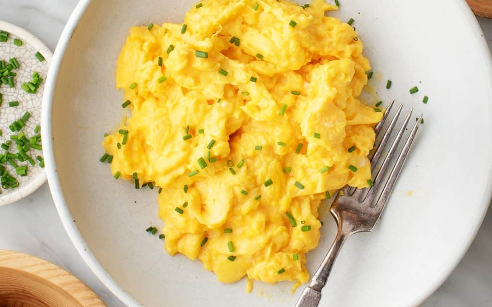

## Workshop 4

by: Kyle Yang

## Emphasis

Opal is a (_SiO2·nH2O_); its water content may range from 3% to 21% by weight, but is usually between 6% and 10%. Due to the amorphous (_chemical_) physical structure, it is classified as a mineraloid, unlike crystalline forms of silica, which are considered minerals. It is deposited at a relatively low temperature and may occur in the fissures of almost any kind of rock, being most commonly found with limonite, sandstone, rhyolite, marl, and basalt.

## strong

There are two broad classes of opal: precious and common. Precious opal displays play-of-color (iridescence); common opal does not. Play-of-color is defined as "**a pseudo chromatic optical effect resulting in flashes of colored light from certain minerals, as they are turned in white light.**" The internal structure of precious opal causes it to diffract light, resulting in play-of-color. Depending on the conditions in which it formed, opal may be transparent, translucent, or opaque, and the background color may be white, black, or nearly any color of the visual spectrum. Black opal is considered the **rarest**, while white, gray, and green opals are the most common.

## lists

### unordered list

- potatoes
- turnips
- carrots
- beets
- garlic

### ordered list

1. make the egg mix
    1. crack eggs into a bowl
    2. whisk until yolk and whites are thoroughly mixed
    3. add milk and whisk again
2. prepare pan
    1. warm pan with medium heat
    2. coat with olive oil, or melt a little butter
3. cook
    1. pour egg mix into pan
    2. begin to scrape the bottom of the pan with a spatula (preferably rubber), forming soft curds
    3. add chopped green onions for flavor(optional)
    4. once all the egg mix has solidified, remove from heat
4. eat
    1. scoop eggs into a plate (optional)
    2. season with salt and pepper(optional)
    3. place egg curds into mouth
    4. chew (optional) and swallow

## image



## hyperlink
<https://moondocool.carrd.co>

## including code

### inline

in HTML the  tag is used to display pictures

### code fences

```html
    <nav>
        <ul>
          <li><a href="index.html">Home</a></li>
          <li><a href="grid.html">Grid</a></li>
          <li><a href="https://trentu.ca">Trent</a></li>
          <li><a href="https://loki.trentu.ca">Loki</a></li>
        </ul>
    </nav>
```

```css
body {
  font-family: system-ui, -apple-system, BlinkMacSystemFont, "Segoe UI", Roboto,
    Oxygen, Ubuntu, Cantarell, "Open Sans", "Helvetica Neue", sans-serif;
  height: 100vh;
  display: flex;
  flex-direction: column;
}
```
